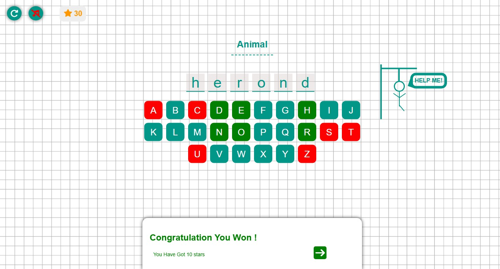
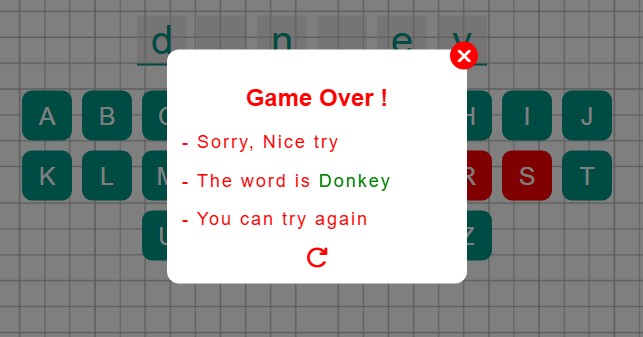

# 🎯 Hangman Game  

A simple yet interactive **word guessing game** built with pure **HTML, CSS, and JavaScript**.  
Enjoy smooth animations, background music, and score saving — all in your browser!  

------
**Level:**  🔴 Advanced
------

## 🧩 Features
- 💾 Local Storage support to save your score.  
- 🎵 Background music toggle (on/off).  
- 🌈 Smooth page transitions & animations.  
- ⭐ Level system with automatic next puzzle.  

---

## 🛠️ Technologies Used
- **HTML5** — Structure & semantic layout  
- **CSS3** — Custom animations & styling  
- **JavaScript (ES6)** — Game logic and interactivity  
- **LocalStorage API** — Saving player progress  

---

## 🕹️ How to Play
1. Click **Start** to begin the game.  
2. Each wrong guess brings the hangman closer to danger!  
3. Win to earn ⭐ points and move to the next word.  
4. Your total score is saved automatically in your browser.  

---

## 🚀 How to Run

1. Download or clone the repository.  
2. Open the file **`index.html`** in any modern web browser.  
> No installation or server required — works fully offline.

---

## 📸 Preview

---

## 👨‍💻 Developer

**Mohamed Beshir**  
🎮 *MB Games Studio*  
